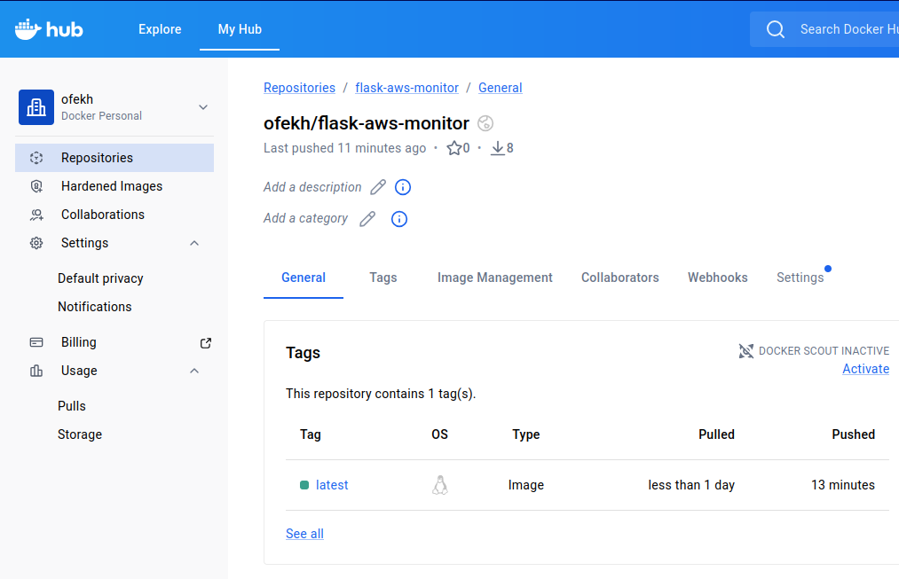

# Flask AWS Monitor - CI/CD Project

This repository contains a Flask-based application designed to monitor AWS resources (EC2, VPCs, Load Balancers, and AMIs). The project focuses on implementing a robust **CI/CD Pipeline** using Jenkins, following DevOps best practices.

## 🚀 Current Project Status: CI/CD Foundation
The project currently features a fully automated Jenkins pipeline that ensures code quality, security, and containerization.

### Pipeline Stages:
* **Source Control**: Automated checkout from GitHub (`master` branch).
* **Linting (Quality)**: Uses `Flake8` to maintain Python code standards.
* **SAST (Security)**: Static application security testing using `Bandit`.
* **Dockerization**: Automated building of a Docker image.
* **Vulnerability Scanning**: Image scanning using `Trivy` to detect container OS vulnerabilities.
* **Artifact Registry**: Automated push to **Docker Hub** (`ofekh/flask-aws-monitor`).

## 🛠 Tech Stack
* **Application**: Python / Flask
* **SDK**: Boto3 (AWS SDK)
* **Automation**: Jenkins (Pipeline-as-Code)
* **Security Tools**: Bandit, Trivy, Flake8
* **Containerization**: Docker

## 🏗 Future Roadmap (Work in Progress)
This project is being developed in stages as part of the DevOps Specialization Course. Upcoming milestones include:
* [ ] **Infrastructure as Code (IaC)**: Provisioning AWS resources using **Terraform**.
* [ ] **Deployment**: Automating deployment to AWS environments (EC2/ECS).
* [ ] **Monitoring**: Integrating advanced monitoring and logging tools.

## 📦 How to Run the Current Version
To run the latest verified image from this pipeline:
```bash
docker pull ofekh/flask-aws-monitor:latest
docker run -p 5001:5001 \
  -e AWS_ACCESS_KEY_ID=your_key \
  -e AWS_SECRET_ACCESS_KEY=your_secret \
  ofekh/flask-aws-monitor


## ✅ Proof of Success
### Jenkins Pipeline Stages


### Docker Hub Verification


